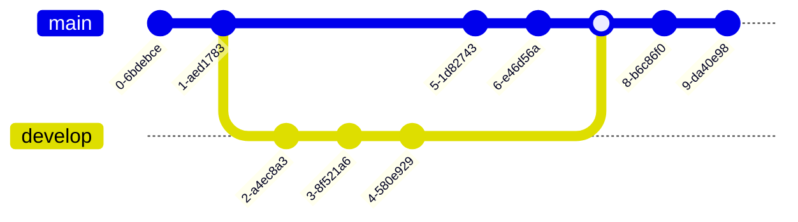

# Diagrams and figures using Mermaid

[mermaid]("https://mermaid.js.org/intro/")

You can find many useful example on this url. (This line was added through syncing with github)

## Class diagram

## Architecture design

## GitGraph

## Sequence diagram

## Pie chart

## XY Chart

## Kanban

